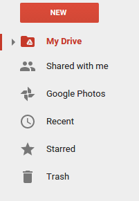
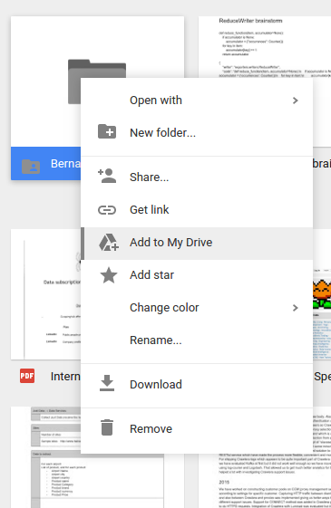

.. _tutorials:

Exporters Tutorial
==================

In this tutorial, we are going to learn how the new exporters work. The purpose of this project is to have a tool to
allow us to export from a wide range of sources to a wide range of targets, allowing to perform complex filtering and transformations to items.

Let's make a simple export
~~~~~~~~~~~~~~~~~~~~~~~~~~
With this tutorial, we are going to a topic in a kafka cluster to a s3 bucket, filtering by country of
the company (We only want American companies). We need to create the proper configuration file. To do so, you can
create a plain json file with the proper data.

Config file
***********
Configuration file should be something like:

.. code-block:: javascript

    {
        "exporter_options": {
            "log_level": "DEBUG",
            "logger_name": "export-pipeline",
            "formatter": {
                "name": "exporters.export_formatter.json_export_formatter.JsonExportFormatter",
                "options": {}
            },
            "notifications":[
            ]
        },
        "reader": {
            "name": "exporters.readers.kafka_scanner_reader.KafkaScannerReader",
            "options": {
                "brokers": [LIST OF BROKERS URLS],
                "topic": "your-topic-name",
                "group": "exporters-test"
            }
        },
        "filter": {
            "name": "exporters.filters.key_value_regex_filter.KeyValueRegexFilter",
            "options": {
                "keys": [
                    {"name": "country", "value": "United States"}
                ]
            }
        },
        "writer": {
            "name": "exporters.writers.s3_writer.S3Writer",
            "options": {
                "bucket": "your-bucket",
                "filebase": "tests/export_tutorial_{:%d-%b-%Y}",
                "aws_access_key_id": "YOUR-ACCESS-KEY",
                "aws_secret_access_key": "YOUR-ACCESS-SECRET"
            }
        }
    }

If we save this file as ~/config.json, the export job would be launched with the following command:

.. code-block:: python

    python bin/export.py --config ~/config.json

GDrive export tutorial
~~~~~~~~~~~~~~~~~~~~~~

Step by Step GDrvie export

First two steps will only have to be done once:

1. Make sure you have your client-secret.json file. If not, follow the steps described `here <https://developers.google.com/drive/web/quickstart/python>`_.
More info about this file can be found `here <https://developers.google.com/api-client-library/python/guide/aaa_client_secrets>`_.

2. Get your credentials file. We have added a script that helps you with this process. Usage:

.. code-block:: shell

    python bin/get_gdrive_credentials.py PATH_TO_CLIENT_SECRET_FILE

It will open a tab in your browser where you can login with your google account. When you
do that, the script will print where the credentials file has been created.

Now, for every delivery:

3. Ask the destination owner to create a folder and share it with our google user.

4. The folder will appear under `Shared with me <https://drive.google.com/drive/shared-with-me>`_ section.

Go there, right click on the shared folder, and click on "Add to my drive".
This will add the folder the client shared with us in our `My Drive
<https://drive.google.com/drive/my-drive>`_. section, which can be seen by exporters.

.. note::

    It is important to do this before executing the export. If not, the export will be made to your own drive storage.

5. Configure writer filepath to point the client's folder. For example, if client shared
with us a folder called "sh-data", and we have added to our drive, writer configuration would be:

.. code-block:: python

   "writer":{
        "name": "exporters.writers.gdrive_writer.GDriveWriter",
        "options": {
            "filebase": "sh-data/gwriter-test_",
            "client_secret": {client-secret.json OBJECT},
            "credentials": {credentials OBJECT}
        }
    }

6. To run the export, we can use the bin/export.py:

.. code-block:: python

    python export.py --config CONFIGPATH